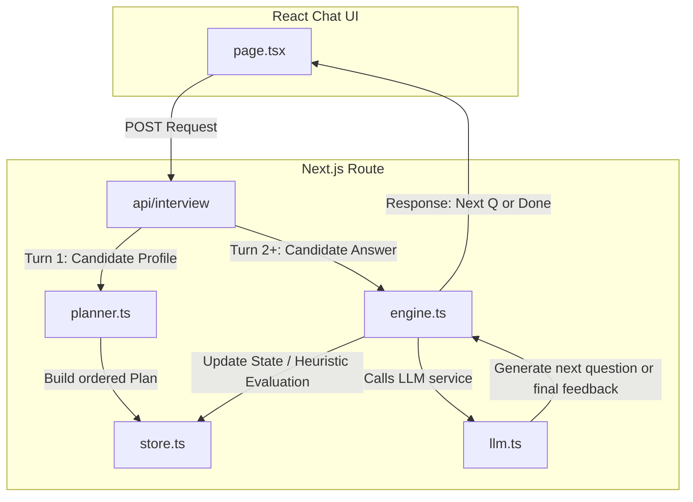

# The Interview Agent (AI Cohort Hackathon Submission)

This repository implements **"The Interview Agent"** — an adaptive, multi-turn technical interviewer personalized to a candidate's real learning journey through a 31-day, 8-module AI Enterprise training program.

## Architecture & Design Decisions

### The Core Problem: The LLM Drift Risk
In a conversational interview, letting a language model freely decide the flow poses a major challenge: **LLMs can drift, hallucinate, repeat themselves, or prematurely end sessions**. This makes satisfying structural constraints (such as asking at least 8 questions across at least 4 distinct curriculum modules) near-impossible to guarantee in a pure-generative setup.

### Our Solution: Hybrid Deterministic + Generative Architecture
To solve this, we decoupled the **interview structure** from the **dialogue synthesis**. The application uses three isolated, extendable modules:



1. **Coverage Planner (`lib/planner.ts` - Plain Code):** 
   Runs deterministically on session start. It parses the candidate's `missions` history and classifies day topics into categories:
   - `struggled` (`attempts > 3`)
   - `skipped` (`skipped: true`)
   - `medium` (`attempts === 3`)
   - `strong` (`attempts <= 2`)
   
   It structures a sorted priority plan covering at least 4 distinct days (struggled -> skipped -> medium -> strong -> backfill) using the curriculum objectives and tools for rich context.

2. **Interview Engine (`lib/engine.ts` - State Machine):**
   A state coordinator that handles state transitions across turns. It evaluates the candidate's latest response:
   - If an answer is **thin/vague/incorrect**, it prompts the LLM to generate a **remedial follow-up** on the same day.
   - If the answer is **solid**, it advances to the next day in the plan once the minimum questions are met.
   - It maintains strict thresholds: max 2 questions per day, minimum 8 questions total, and minimum 4 days covered.

3. **LLM Wrapper (`lib/llm.ts` - Generative Layer):**
   Leverages the **Google Gemini 2.5 Flash** model via the `@google/genai` SDK. It is responsible for:
   - Formulating natural questions grounded in the candidate's journey (e.g., mentioning that they spent 4 attempts or skipped a day).
   - Performing a structured JSON evaluation of candidate answers (scoring them as `solid` or `thin`).
   - Synthesizing detailed, actionable final feedback (summary, strengths, gaps, next steps) with zero generic boilerplate.

### Why this is optimal for the Stage 4 "Live Steer Challenge"
During the 20-minute Live Steer Challenge, we might be asked to change the sorting order of days, adjust the follow-up threshold, or add a scoring metric. Because the **state machine and planner are written in plain, readable TypeScript** and separated from the LLM prompts, making these modifications takes seconds and carries zero risk of breaking the LLM prompt's instruction compliance.

---

## Technical Stack
- **Framework:** Next.js (App Router)
- **Language:** TypeScript
- **Styling:** Vanilla CSS (glowing borders, glassmorphic filters, responsive layout)
- **AI SDK:** `@google/genai` (Gemini 2.5 Flash)
- **State Store:** In-memory `Map` (reset upon app restart, satisfying the persistent-free requirement)

---

## Getting Started

### 1. Prerequisites
- Node.js `v20+` or `v24+` installed.

### 2. Install Dependencies
```bash
npm install
```

### 3. Configure Environment Variables
Create a `.env.local` file in the root directory:
```env
GEMINI_API_KEY="your-api-key-here"
# Set to true to run with the high-fidelity mock AI runner without needing a Gemini key:
MOCK_LLM="false"
```

### 4. Running the App locally
To start the developer server:
```bash
npm run dev
```
Open [http://localhost:3000](http://localhost:3000) to view the UI.

---

## Verification & Testing

### Automated CLI Simulation Test
We have provided an automated end-to-end interview simulation script that mocks the LLM responses to test the state machine and planner logic:
```bash
npx tsx scratch/verify-flow.ts
```

This simulates the interview for:
1. **Sarah Johnson** (Senior Data Engineer): Tests how the engine behaves with a mix of struggled, skipped, and strong modules.
2. **Emily Chen** (AI Engineer): Tests how the engine probes deeper into a candidate who passed everything on the first try.
